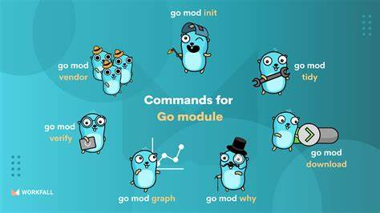

# Packages and modules in Go

Every go program is made up of packages.

like, `package main` you have been written on every go program. A package named `main` has an entrypoint at the `main()` function. A main package is compiled into an executable program.

- A package by any other name is "library package". Libraries has no entry point.

```go
package main

import "fmt"

func main(){
    fmt.Println("Hello! there")
}
```

- This program is an executable. It is a `main` package and imports  from the `fmt` library package.

### package Naming

By convention, A package's name is the same as the same element of its import path. for example `math/rand` package comprises files that begin with: 

```go
package rand
```

That said, the package don't need to be same as import path.

<details>
<summary style="font-size:1.1rem;font-weight:bold;margin-bottom:5px;">One package/ Directory</summary>
<p>
A directory of Go can have <code>at most</code> one package.All .go files in one directory must belong to one package. If they don't an error will thrown from compiler while compiling. This is true for main and library package alike.
</p>
</details>


## Modules

Go programs are organized into packages.A package is a directory of Go code that's all compiled together.functions,types variables, and constants defined in one source fiel are visible in **all other source files within the directory/package**

- A repository contain one ore more modules.
- A module is collection of many packages  that are relased together.




<details>
<summary style="font-size:1.1rem;font-weight:bold;margin-bottom:5px;">One modueles per repo/Usually</summary>
<p>A file named <code>go.mod</code> file at the root of a project contain the modules. it contains:</p>
<ul>
<li>The module path</li>
<li>The version of the go language. project requires</li>
<li>Optionally, and external packages dependencies</li>
</ul>

<p>The module path is just import path prefix for all packages within the modules. here's an example of <code>go.mod</code> file:</p>

```
module github.com/bootdotdev/exampleproject

go 1.23.0

require github.com/google/examplepackage v1.3.0
```
</details>

### Setting up machine

- We can have many git repo on our machine (typically one per project)
- Each repo contains one or more repo.
- Each repo is typically a single module.

#### Go run

With `go run` filename.go we can run the file without needing to compile it. It's helps while testing go files.

- For further instructions use `go help run` and read

#### Go build

With `go build` it compiles the file or whole modules in binary form . 

- For further instructions use `go help build` and read


### Custom Package

Let's create a custom package

Steps:

1. Create a directory named `mystring` 

```sh
mkdir mystring
cd mystring
touch mystring.go 
```

2. Initalize a module:

```sh
go mod github.com/username/mystring
```

3. Create a file named `mystring.go`, it simply reverse strings

```go
package mystring

func Reverse(str string)string{
    result=""
    for _,s:=range str{
        result=string(s)+result
    }
    return result
}
```

4. We don't used `package main` because we are creating just a library which reverse string, that said run `go build` this will complile our package and save it in our local build cache.


6. Now you can import this package in other modules, like for example:

```go
package main

import "fmt"
import "github.com/{username}/mystring"

func main(){
    fmt.Println(mystring.Reverse("hello there"))
    // myString.Reverse will reverse the given string.
}
```


7. Edit the `go.mod` file where you used your created package like this:


```
module example.com/username/currentProject

go 1.23.0

replace example.com/username/mystrings v0.0.0 => ../mystrings

require (
	example.com/username/mystrings v0.0.0
)
```


