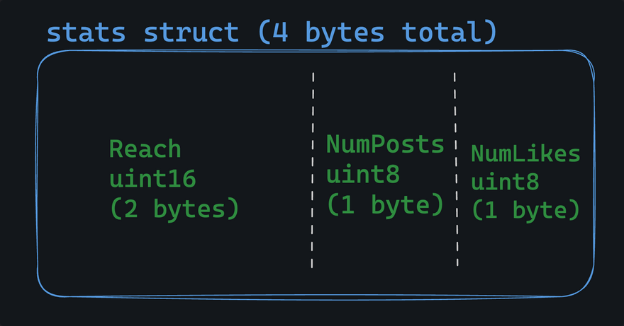

# Struct

### Anonymous Structs in Go

A Anonymous struct is just like normal struct but you can't reuse it and you can only declear it once

```go
anonStruct:=struct{
    something string 
    val int8
}{
    something:"something",
    val:0,
}
```

### Embedded Struct

**Go is not an Object-oriented language**. However embedded struct provide a kind of *data-only* inheritance 

- Keep in mind ,  Go doesn't support classes or inheritance in complete sense but, embedded struct are way to share fields between struct definitions   

### Struct method in Go

Methods are just functions that have *reciever*. A reciever is a special parameter that syntactically goes before the name of the function

ex,

```go
type rect struct{
    width int
    height int
}

func (r rect) area() int{
    return r.width*r.height
}

var r=rect{
    width:25,
    height:50,
}

fmt.Println(r.area())
```

- A receiver is speical kind of function parameter.
- In the above example, the `r` in `rect` could just be easily `rec` or x,y or z.
- By convention, Go will always use first letter of the struct's name

#### Empty Struct

[Empty struct](https://dave.cheney.net/2014/03/25/the-empty-struct) in go used as a unary value

syntax,
```go
// anonymous empty struct type
empty := struct{}{}

// named empty struct type
type emptyStruct struct{}
empty := emptyStruct{}
```

- Since, Empty string use Zero byte we can use it for various purpose like, with `map` , immutability or Flag Representation

### Memory layout

In Go, struct sit in  memory in contigous block, with fields defined one after another as in struct it's easy and efficient.

for example,

```go
type stats struct {
	Reach    uint16
	NumPosts uint8
	NumLikes uint8
}
```
Looks like this in memory:



